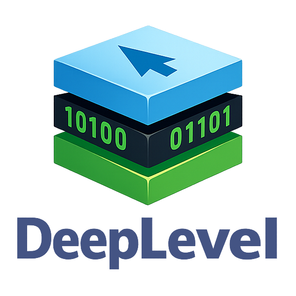

<div align="center">
    
    <h3><i>Complex data types made easy 🗃️</i></h3><br />
    </img>
    </img>
    </img>
    <hr /><br />
</div>

A 0 dependencies 🥳 low-level, **ABI-accurate** struct/union/array layout and
serialization library for TypeScript, Deno 🦖.

<hr />

## Why? 🤔

Since Deno introduced **FFI** support, I immediately fell in love with its API.
However, it was missing something essential: support for complex data types.
There was no built-in way to define or work with structures, unions, arrays, and
similar constructs-features that are fundamental when dealing with **FFI**.

Out of that need, I created **DeepLevel**: a library designed to provide a clean
and intuitive API while remaining robust enough to handle low-level memory
layouts and data structures with precision.

## Coding Style ✍️


The **DeepLevel** project follows Deno's official formatting standards. All
source code is automatically formatted using the `deno fmt` command, with
settings defined in the `deno.json` configuration file.

<hr />

**DeepLevel** lets you define C/C++-like data structures in TypeScript with
**exact memory layout control**, including:

- Structs
- Unions
- Arrays

It follows the ABI behavior of **MSVC, GCC, and Clang (x64)** for
standard-layout types.

<hr />

## ✨ Features

- 🧠 **ABI-accurate layout**
  - Correct alignment, padding, and offsets
  - Matches MSVC / GCC / Clang (x64)

- 📦 **Binary serialization**
  - Pack JS objects into raw memory buffers
  - Unpack buffers back into structured objects

- 🔁 **Union support**
  - Proper memory overlap

- 📏 **Packed structs**
  - Disable padding (`#pragma pack(1)` equivalent)

- 🧬 **Nested structures and unions**
  - Structs inside structs
  - Unions inside structs
  - Arrays inside structs
  - Arbitrary deep nesting

- 📚 **Arrays**
  - Fixed-length arrays with correct stride

- 🧩 **Shape-preserving type system**
  - Types directly mirror the structure of defined layouts. Structs, unions, and
    arrays are represented as nested TypeScript object shapes, providing
    accurate typing that reflects the underlying memory layout.

- 📋 **Constants**
  - Provides exhaustive constants for Unix systems, Windows systems, and
    dinamically generated constants that match the target platform's properties.
  - Exhaustive list of C/C++/Windows data types mapped to Deno FFI types.

- 💻 **Target system integration**
  - There are system constants that match the target system's properties, like
    its architecture, endianness and more.
  - Cross-platform

- 👨‍💻 **Easy debugging**
  - Using `Deno.inspect()` or `console.log()` you can get a nice view of the
    complex data type, including offset of each field, size, alignment,
    endianness and more.

---

## Importing 📥

You can import **DeepLevel** in your projects like this:

```ts
import * as deeplevel from "jsr:@jabonchan/deeplevel";
```

## Quick Examples and Showcases 🚀

**Code:**

> Creating an structure is more easy than ever!

```ts
import * as deeplevel from "./mod.ts";

const t = deeplevel.constants.DefaultPrimitiveTypes;

const Vec3 = new deeplevel.Struct({
    fields: [
        { name: "x", type: t["float"] },
        { name: "y", type: t["float"] },
        { name: "z", type: t["float"] },
    ],
});

const value = { x: 1, y: 2, z: 3 };

const buffer = Vec3.pack(value);
const result = Vec3.unpack(buffer);

console.log(result);
```

**Output:**

> Result is a normal JS object.

```ts
{ x: 1, y: 2, z: 3 }
```

**Code:**

> Creating an union.

```ts
import * as deeplevel from "./mod.ts";

const t = deeplevel.constants.DefaultPrimitiveTypes;

const U = new deeplevel.Union({
    a: t["int"],
    b: t["double"],
});

console.log(U);
```

**Output:**

> Isn't it beautiful how complex data is printed to the console?

```cpp
(Offset:0x00:0 Size:0x08:8) union unnamed {
    Endianness: Little // (Or "Big" depending on your system)
    Alignment: 0x08:8 Natural // (Or "Packed" if specified so)
    Padding: 0x00:0
    Total Size: 0x08:8
    Size: 0x08:8

    (Offset:0x00:0 Size:0x04:4) i32 a
    (Offset:0x00:0 Size:0x08:8) f64 b
}
```

**Code:**

> Creating an array (fancy name for single property union).

```ts
import * as deeplevel from "./mod.ts";

const t = deeplevel.constants.DefaultPrimitiveTypes;
const A = deeplevel.helpers.createArray(t["int"], 3);

const value = { "[ARRAY_ITEMS]": [1, 2, 3] };

const buffer = A.pack(value);
const result = A.unpack(buffer);

console.log(result["[ARRAY_ITEMS]"]);
```

**Output:**

> Yep, on deeplevel arrays are unions in disguise.

```cpp
[ 1, 2, 3 ]
```

## Documentation 📚

### **Types**

---

- **Reference:** `ArrayDeclaration` refers to the definition of a native array
  (`int[4]` for example), its definition is
  `{ length: number, type: ValueDeclarationType }`. It is also considered a
  `ValueDeclarationType`.

---

- **Reference:** `ValueDeclarationType` refers to the definition of a type. It's
  an union of `Struct`, `Union`, `Deno.NativeType` (Without the
  `Deno.NativeStructType`) and `ArrayDeclaration` (Example: `"i32"`).

---

- **Reference:** `Declaration` refers to the shape of a structure or union.
  Depending on the context it can be `{ [name: string]: ValueDeclarationType }`
  for unions or `{ name: string, type: ValueDeclarationType }[]` for structures.

---

- **Reference:** `ComplexType` refers to `Union` or `Struct`.

---

- **Reference:** `NativeValue` refers to the JS equivalent of a FFI type. That
  means `number`, `bigint`, `Deno.PointerValue`, `boolean`, `Array<NativeValue>`
  or an unpacked `Struct` or `Union`. If we are on the context of passing the
  input to a `.pack()` function then we are also talking about `TypedArray`s and
  `ArrayBuffer`, which are not used by `.unpack()`.

---

- **Exported:** `deeplevel.type.StructTypeof<Declaration, Name>` - Generic type
  that returns the `ValueDeclarationType` associated to `Name` inside
  `Declaration`.

---

- **Exported:** `deeplevel.type.UnionTypeof<Declaration, Name>` - Generic type
  that returns the `ValueDeclarationType` associated to `Name` inside
  `Declaration`.

---

- **Exported:** `deeplevel.type.ExtractDeclaration<ComplexType>` - Generic type
  that returns the `Declaration` that was used to initialize the `Union` or
  `Struct`.

---

- **Exported:** `deeplevel.type.UnpackedStruct<Declaration>` - Generic type that
  returns an object whose shape mirrors the native struct shape defined on
  `Declaration`. It basically returns an object with `NativeValue`s.

---

- **Exported:** `deeplevel.type.UnpackedUnion<Declaration>` - Generic type that
  returns an object whose properties are every possible interpretation of the
  data specified on `Declaration`. It basically returns an object with
  `NativeValue`s

---

### **Enums**

- `deeplevel.types.Endianness`: When using `System` it fallbacks to the system's
  endianness. Otherwise the specified endianness is used on structures/unions.
  - System = `0`
  - Little
  - Big

- `deeplevel.types.TextEncoding`: Unused for now.
  - ASCII = `0`
  - UTF16
  - UTF32

- `deeplevel.types.PrimitiveTextEncoding`: Unused for now.
  - ASCII = `0`

- `deeplevel.types.WideTextEncoding`: Unused for now.
  - UTF16 = `1`
  - UTF32

- `deeplevel.types.Alignment`: Specifies whenever alignment should be used or
  not on structures/unions.
  - Natural = `0`
  - Packed

### **Constants (Values)**

- `deeplevel.constants.SystemEndianness`: Detected endianness of the current
  system at runtime.
  - `Little`: System is little-endian (least significant byte first).
  - `Big`: System is big-endian (most significant byte first).

- `deeplevel.constants.SystemPointerSize`: Size of a native pointer in bytes for
  the current platform.
  - `4`: 32-bit systems.
  - `8`: 64-bit systems.

### **Constants (Namespaces)**

- `deeplevel.constants.Platform`: Runtime platform information derived from Deno
  and system inspection.
  - `os`: Operating system (`"windows"`, `"linux"`, `"darwin"`, etc.).
  - `arch`: CPU architecture (`"x86_64"`, `"aarch64"`, etc.).
  - `isLE`: `true` if system is little-endian.
  - `isBE`: `true` if system is big-endian.
  - `isWindows`: `true` if running on Windows.
  - `isUnixLike`: `true` if running on a Unix-like OS (Linux/macOS).
  - `is32Bit`: `true` if architecture is 32-bit.
  - `is64Bit`: `true` if architecture is 64-bit.

- `deeplevel.constants.PrimitiveText`: Text and encoding-related constants for
  primitive types.
  - `nullchar`: Null terminator character (`"\x00"`).
  - `DefaultWideCharSize`: Size (in bytes) of `wchar_t` (2 on Windows, 4 on
    Unix-like systems).
  - `DefaultWideEncoding`: Default wide character encoding (`UTF-16` on Windows,
    `UTF-32` elsewhere).

- `deeplevel.constants.DenoPrimitiveTypes`: Primitive types supported by Deno
  FFI.
  - `bool`: Boolean type.
  - `void`: Void type (no value).
  - `u8`, `u16`, `u32`, `u64`: Unsigned integers (8, 16, 32, 64-bit).
  - `i8`, `i16`, `i32`, `i64`: Signed integers (8, 16, 32, 64-bit).
  - `f32`, `f64`: Floating point types (32-bit, 64-bit).
  - `isize`: Signed pointer-sized integer.
  - `usize`: Unsigned pointer-sized integer.
  - `pointer`: Raw pointer type.
  - `buffer`: Buffer type.
  - `function`: Function pointer type.

- `deeplevel.constants.DefaultPrimitiveTypes`: Platform-aware mappings of common
  C/C++ types to internal primitive representations.
  - `void`: Void type.
  - `char`: Native `char` type (platform-dependent signedness).
  - `short`: 16-bit signed integer.
  - `int`: 32-bit signed integer.
  - `long`: Platform-dependent (`i32` or `i64`).
  - `wchar_t`: Platform-dependent wide character type.
  - `float`: 32-bit floating point.
  - `double`: 64-bit floating point.
  - `bool`: Boolean type.
  - `size_t`: Unsigned pointer-sized integer.

  - `unsigned char`: 8-bit unsigned integer.
  - `unsigned short`: 16-bit unsigned integer.
  - `unsigned int`: 32-bit unsigned integer.
  - `unsigned long`: Platform-dependent unsigned integer.
  - `unsigned long int`: Same as `unsigned long`.
  - `unsigned long long`: 64-bit unsigned integer.
  - `unsigned long long int`: Same as above.
  - `unsigned size_t`: Unsigned pointer-sized integer.

  - `signed char`: 8-bit signed integer.
  - `signed short`: 16-bit signed integer.
  - `signed int`: 32-bit signed integer.
  - `signed long`: Platform-dependent signed integer.
  - `signed long int`: Same as `signed long`.
  - `signed long long`: 64-bit signed integer.
  - `signed long long int`: Same as above.
  - `signed size_t`: Signed pointer-sized integer.

  - `long int`: Platform-dependent signed integer.
  - `long long`: 64-bit signed integer.
  - `long long int`: Same as above.

  - `void *`: Pointer type.
  - `char *`: Pointer type.
  - `void (*)(*)`: Function pointer type.

- `deeplevel.constants.UnixPrimitiveTypes`: Fixed mappings of C/C++ types
  following Unix (LP64) conventions.
  - `void`: Void type.
  - `char`: 8-bit unsigned integer.
  - `short`: 16-bit signed integer.
  - `int`: 32-bit signed integer.
  - `long`: 64-bit on 64-bit systems, otherwise 32-bit.
  - `wchar_t`: 32-bit unsigned integer.
  - `float`: 32-bit floating point.
  - `double`: 64-bit floating point.
  - `bool`: Boolean type.
  - `size_t`: Unsigned pointer-sized integer.

  - `unsigned char`: 8-bit unsigned integer.
  - `unsigned short`: 16-bit unsigned integer.
  - `unsigned int`: 32-bit unsigned integer.
  - `unsigned long`: 64-bit on 64-bit systems, otherwise 32-bit.
  - `unsigned long int`: 64-bit unsigned integer.
  - `unsigned long long`: 64-bit unsigned integer.
  - `unsigned long long int`: Same as above.
  - `unsigned size_t`: Unsigned pointer-sized integer.

  - `signed char`: 8-bit signed integer.
  - `signed short`: 16-bit signed integer.
  - `signed int`: 32-bit signed integer.
  - `signed long`: 64-bit on 64-bit systems, otherwise 32-bit.
  - `signed long int`: 64-bit signed integer.
  - `signed long long`: 64-bit signed integer.
  - `signed long long int`: Same as above.
  - `signed size_t`: Signed pointer-sized integer.

  - `long int`: 64-bit signed integer.
  - `long long`: 64-bit signed integer.
  - `long long int`: Same as above.

  - `void *`: Pointer type.
  - `char *`: Pointer type.
  - `void (*)(*)`: Function pointer type.

- `deeplevel.constants.WindowsPrimitiveTypes`: Fixed mappings of C/C++ types
  following Windows (LLP64) conventions.
  - `void`: Void type.
  - `char`: 8-bit signed integer.
  - `short`: 16-bit signed integer.
  - `int`: 32-bit signed integer.
  - `long`: 32-bit signed integer (LLP64 model).
  - `wchar_t`: 16-bit unsigned integer (UTF-16 code unit).
  - `float`: 32-bit floating point.
  - `double`: 64-bit floating point.
  - `bool`: Boolean type.
  - `size_t`: Unsigned pointer-sized integer.

  - `unsigned char`: 8-bit unsigned integer.
  - `unsigned short`: 16-bit unsigned integer.
  - `unsigned int`: 32-bit unsigned integer.
  - `unsigned long`: 32-bit unsigned integer.
  - `unsigned long int`: Same as `unsigned long`.
  - `unsigned long long`: 64-bit unsigned integer.
  - `unsigned long long int`: Same as above.
  - `unsigned size_t`: Unsigned pointer-sized integer.

  - `signed char`: 8-bit signed integer.
  - `signed short`: 16-bit signed integer.
  - `signed int`: 32-bit signed integer.
  - `signed long`: 32-bit signed integer.
  - `signed long int`: Same as `signed long`.
  - `signed long long`: 64-bit signed integer.
  - `signed long long int`: Same as above.
  - `signed size_t`: Signed pointer-sized integer.

  - `long int`: 32-bit signed integer.
  - `long long`: 64-bit signed integer.
  - `long long int`: Same as above.
  - `long double`: 64-bit floating point (mapped to `f64` in this
    implementation).

  - `void *`: Pointer type.
  - `char *`: Pointer type.
  - `void (*)(*)`: Function pointer type.

- `deeplevel.constants.WindowsValues`: Values used in Windows API.
  - `NULL`: 0
  - `TRUE`: 1
  - `FALSE`: 0

- `deeplevel.constants.WindowsAPITypes`: Every property is the name of a Windows
  Data Type name mapped to its corresponding Deno FFI type (exhaustive list,
  source:
  https://learn.microsoft.com/en-us/windows/win32/winprog/windows-data-types).
  - `ATOM`
  - `BOOL`
  - ...
  - `WPARAM`

---

### **Class `deeplevel.Struct`**

#### **Definition**

```ts
Struct<const Declaration extends readonly {
    name: string;
    type: ValueDeclarationType;
}[]>
```

#### **Methods**

`::constructor()`: Creates a new instance of `Struct`.

```ts
function constructor(
    opts: {
        endianness?: deeplevel.types.Endianness;
        fields: Declaration;
        size?: number;
        align?: deeplevel.types.Alignment;
    },
);
```

**Parameters:**

- `opts`: Specifies the shape and parameters of the structure.
  - `endianness`: `deeplevel.types.Endianness` - Controls whenever the structure
    is encoded as big or little endian. Defaults to
    `deeplevel.types.Endianness.System`
  - `fields`: `NativeTypeDeclaration` - An array is used to ensure order is
    preserved. Can have nested structures, unions and arrays.
  - `align`: `deeplevel.types.Alignment` - Whenever to use standard **ABI**
    alignment and padding or use **Packed** (same as `#pragma pack(1)`).
    Defaults to `deeplevel.types.Alignment.Natural`.
  - `size`: Minimum size to use for the structure. If size is bigger than the
    resulting size then padding is added at the end, othersie if is smaller,
    then it's ignored. Defaults to `1`.

---

`::toString()` & `::Symbol.for("Deno.customInspect")`: Returns a string showing
useful info about the structure.

---

`::offsetof()`: Returns the offset of a field inside the structure.

```ts
function offsetof<Name extends Declaration[number]["name"]>(name: Name): number;
```

- `name`: `string` - The name of the field to lookup its offset.

---

`::typeof()`: Returns the type associated to a field inside the structure.

```ts
function typeof<Name extends Declaration[number]["name"]>(name: Name): StructTypeof<Declaration, Name>
```

- `name`: `string` - The name of the field to lookup its type (For reference
  read the type `ValueDeclarationType`).

---

`::alignof()`: Returns the alignment of a field inside the structure

```ts
function alignof<Name extends Declaration[number]["name"]>(name: Name): number;
```

- `name`: `string` - The name of the field to lookup its alignment.

---

`::sizeof()`: Returns the size of a field inside the structure.

```ts
function sizeof<Name extends Declaration[number]["name"]>(name: Name): number;
```

- `name`: `string` - The name of the field to lookup its size.

---

`::pack()`: Turns an `UnpackedStruct` onto an ArrayBuffer.

```ts
function pack(
    object: UnpackedStruct<Declaration>,
    buff?: ArrayBuffer,
    offset?: number,
): ArrayBuffer;
```

- `object`: `UnpackedStruct` - Read above under the section `Types` for more
  info.
- `buff`: `ArrayBuffer` - Destiny buffer where the encoded object will go. A new
  one is created if none is provided.
- `offset`: `number`. Where to start writing. Defaults to `0`.

---

`::unpack()`: Turns an `ArrayBuffer` onto an `UnpackedStruct`.

```ts
function unpack(
    buff: ArrayBuffer,
    offset?: number,
): UnpackedStruct<Declaration>;
```

- `buff`: `ArrayBuffer` - Source buffer from where the encoded data will be
  read.
- `offset`: `number`. Where to start reading from. Defaults to `0`.

---

#### **Properties**

- `readonly isLittleEndian`: `boolean` - Whenever the structure is little endian
  or not.

---
- ``readonly isBigEndian``: ``boolean`` - Whenever the structure is big endian or not.
---

- `readonly endianness`: `deeplevel.types.Endianness` - The endianness used for
  the structure.

---
- ``readonly fields``: ``{ [name: string]: { offset: number, type: ValueDeclarationType } }`` - The fields used to define the ``Struct``'s layout.
---

- `readonly align`: `deeplevel.types.Alignment` - Whenever the structure has
  natural padding or packed.

---
- ``readonly byteLength``: ``number`` - The total size on bytes of the structure.
---

- `readonly alignment`: `number` - The alignment of the structure.

---
- ``readonly padding``: ``number`` - Amount of padding bytes added after the last field
---

- `readonly size`: `number` - The size of the structure counting only until the
  last field. May be equal to `byteLength` or not.

---

#### **Static**

`isStruct()`: Checks whenever a value is instance of a struct.

```ts
function isStruct(value: unknown): value is Struct;
```

- `value`: `unknown` - Value to check for if it's a `Struct`.

### **Class `deeplevel.Union`**

#### **Definition**

```ts
Union<const Declaration extends {
    [name: string]: ValueDeclarationType;
}>
```

#### **Methods**

`::constructor()` - Creates a new instance of `Union`.

```ts
function constructor(values: Declaration, opts?: { size?: number, endianness?, deeplevel.types.Endianness, align?: deeplevel.types.Alignment });
```

**Parameters:**

- `values`: `{ [name: string]: ValueDeclarationType }` - Object describing union
  fields. All fields share the same memory region.
- `opts`: Optional configuration.
  - `endianness`: `deeplevel.types.Endianness` - Controls whether the union is
    encoded as little or big endian. Defaults to
    `deeplevel.types.Endianness.System`.
  - `align`: `deeplevel.types.Alignment` - Controls alignment strategy. Defaults
    to `deeplevel.types.Alignment.Natural`.
  - `size`: `number` - Minimum size of the union. If larger than the computed
    size, padding is added. Defaults to `1`.

---

`::toString()` & `::Symbol.for("Deno.customInspect")`: Returns a formatted
string with useful information about the union.

---

`::typeof()` - Returns the type associated to a field inside the union.

```ts
function typeof<Name extends keyof Declaration>(name: Name): UnionTypeof<Declaration, Name>
```

- `name`: `string` - The name of the field.

---

`::alignof()` - Returns the alignment of a field.

```ts
function alignof<Name extends keyof Declaration>(name: Name): number;
```

- `name`: `string` - The name of the field.

---

`::sizeof()` - Returns the size of a field.

```ts
function sizeof<Name extends keyof Declaration>(name: Name): number;
```

- `name`: `string` - The name of the field.

---

`::pack()` - Encodes an `UnpackedUnion` into an `ArrayBuffer`.

```ts
function pack(
    object: UnpackedUnion<Declaration>,
    buff?: ArrayBuffer,
    offset?: number,
): ArrayBuffer;
```

- `object`: `UnpackedUnion` - Object containing the value to write. Only
  provided fields are written.
- `buff`: `ArrayBuffer` - Destination buffer. A new buffer is created if not
  provided.
- `offset`: `number` - Byte offset to start writing from. Defaults to `0`.

---

`::unpack()` - Decodes an `ArrayBuffer` into an `UnpackedUnion`. It contains
every possible interpretation of the data according to the declaration as a
property.

```ts
function unpack(buff: ArrayBuffer, offset?: number): UnpackedUnion<Declaration>;
```

- `buff`: `ArrayBuffer` - Source buffer to read from.
- `offset`: `number` - Byte offset to start reading from. Defaults to `0`.

---

#### **Properties**

- `readonly isLittleEndian`: `boolean` - Whether the union uses little-endian
  encoding.
- `readonly isBigEndian`: `boolean` - Whether the union uses big-endian
  encoding.
- `readonly endianness`: `deeplevel.types.Endianness` - Active endianness.

- `readonly fields`: `{ [name: string]: ValueDeclarationType }` - Field
  definitions mapped to their internal representation.

- `readonly align`: `deeplevel.types.Alignment` - Alignment mode used for the
  union.
- `readonly alignment`: `number` - Maximum alignment required among all fields.

- `readonly byteLength`: `number` - Total size in bytes (including padding).
- `readonly padding`: `number` - Padding added after the last field.
- `readonly size`: `number` - Size of the union before trailing alignment
  padding is applied.

---

#### **Static**

`isUnion()` - Checks whether a value is a `Union` instance.

```ts
function isUnion(value: unknown): value is Union;
```

- `value`: `unknown` - Value to check.

---

### **Helpers**

`deeplevel.helpers.createArray()`: Creates an union with a single member named
`"[ARRAY_ITEMS]"` that inside contains an `ArrayDeclaration`.

```ts
function createArray<const Declaration extends ValueDeclarationType>(
    type: Declaration,
    length: number,
    opts: {
        size?: number;
        endianness?: deeplevel.types.Endianness;
        align?: deeplevel.types.Alignment;
    },
): Union<
    {
        readonly "[ARRAY_ITEMS]": {
            readonly length: number;
            readonly type: Declaration;
        };
    }
>;
```

- `type`: `ValueDeclarationType` - The type of the items inside the array.
- `length`: `number` - The size of the array
- `opts`: Optional configuration.
  - `endianness`: `deeplevel.types.Endianness` - Controls whether the union is
    encoded as little or big endian. Defaults to
    `deeplevel.types.Endianness.System`.
  - `align`: `deeplevel.types.Alignment` - Controls alignment strategy. Defaults
    to `deeplevel.types.Alignment.Natural`.
  - `size`: `number` - Minimum size of the union. If larger than the computed
    size, padding is added. Defaults to `1`.

---

`deeplevel.helpers.offsetof()`: Returns the offset of a field inside a
structure.

```ts
export function offsetof<
    const Declaration extends readonly {
        name: string;
        type: ValueDeclarationType;
    }[] = readonly [],
>(struct: Struct<Declaration>, name: Declaration[number]["name"]): number;
```

- `struct`: `Struct` - The structure where to search the field's offset.
- `name`: `string` - The name of the field to lookup its offset.

---

`deeplevel.helpers.alignof()`: Returns the alignment of a type.

```ts
function alignof(
    type: ValueDeclarationType,
    align?: deeplevel.types.Alignment,
): number;
```

- `type`: `ValueDeclarationType` - The type to check align of.
- `align`: `deeplevel.types.Alignment` - If se to **Packed** then 1 is always
  returned. Defaults to `deeplevel.types.Alignment.Natural`.

---

`deeplevel.helpers.sizeof()`: Returns the size of a type.

```ts
function sizeof(
    type: ValueDeclarationType | "wchar" | "char" | "void",
): number;
```

- `type`: `ValueDeclarationType` - The type to check its size.

---

`deeplevel.helpers.address()`: Returns the address of a pointer source.

```ts
function address(
    ptr: Deno.PointerValue | TypedArray | ArrayBuffer,
): bigint;
```

- `ptr`: `Deno.PointerValue | TypedArray | ArrayBuffer` - The pointer source.

---

`deeplevel.helpers.create()`: Returns the address of a pointer source.

```ts
function create(addr: number | bigint): Deno.PointerValue;
```

- `addr`: `number | bigint` - The address that's gonna be used to create the
  pointer.

---

`deeplevel.helpers.offsetAddr()`: Adds an offset to a pointer and returns a new
pointer.

```ts
function offsetAddr(
    ptr: Deno.PointerValue,
    offset: number | bigint,
): Deno.PointerValue;
```

- `ptr`: `Deno.PointerValue` - The pointer source.
- `offset`: `number | bigint` - The offset to add to the pointer.

---

`deeplevel.helpers.malloc()`: Allocates a certain amount of memory and returns a
pointer to it.

```ts
function malloc(size: number): Deno.PointerValue;
```

- `size`: `number` - The size of the memory to allocate

---

`deeplevel.helpers.calloc()`: Allocates `count` times the size of `type` of
memory

```ts
function calloc(
    type: ValueDeclarationType,
    count: number,
): Deno.PointerValue;
```

- `type`: `ValueDeclarationType` - The data we're going to retrieve the size
  from.
- `count`: `number` - How many times we are going to allocate for `type`.

---

`deeplevel.helpers.memset()`: Fills a memory region with a specified byte.

```ts
function memset(
    dest: Deno.PointerValue,
    byte: number,
    size: number,
): Deno.PointerValue;
```

- `dest`: `Deno.PointerValue` - Pointer to the memory region to fill.
- `byte`: `number` - The byte we're going to fill it with.
- `size`: `number` - How much we want to fill.

---

`deeplevel.helpers.ZeroMemory()`: Fills with zeroes a memory region.

```ts
function ZeroMemory(
    dest: Deno.PointerValue,
    size: number,
): Deno.PointerValue;
```

- `dest`: `Deno.PointerValue` - Pointer to the memory region to fill.
- `size`: `number` - How much we want to fill with zeroes.

---

## Running Tests ⚙️

**DeepLevel** uses Deno's built-in test feature. To run all the tests, use the
following command _(Some permissions may be required like `--allow-ffi`)_:

```bash
deno test
```

## Dependencies 🗃️

**DeepLevel** is dependency free! 🥳

## LICENSE 🔒

**DeepLevel** is licensed under the MIT License. By using this library, you
agree to all the terms and conditions stated in the license.
